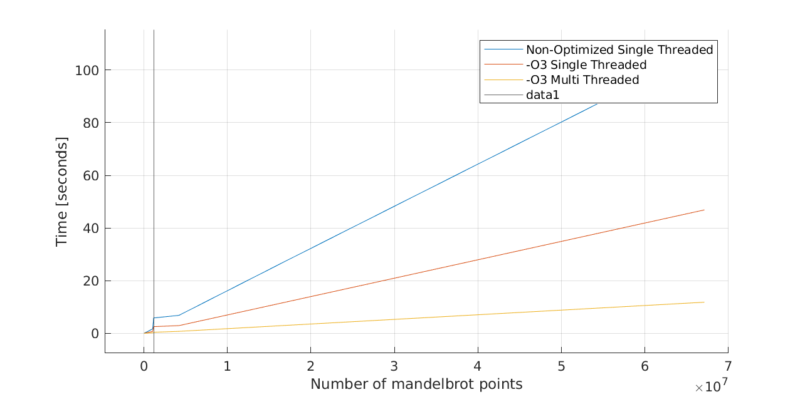
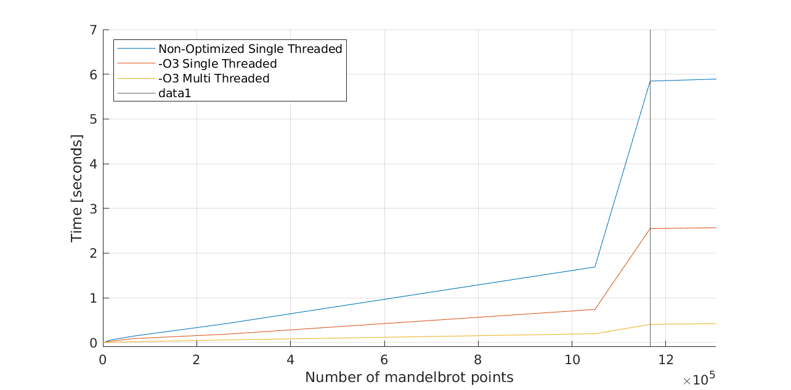
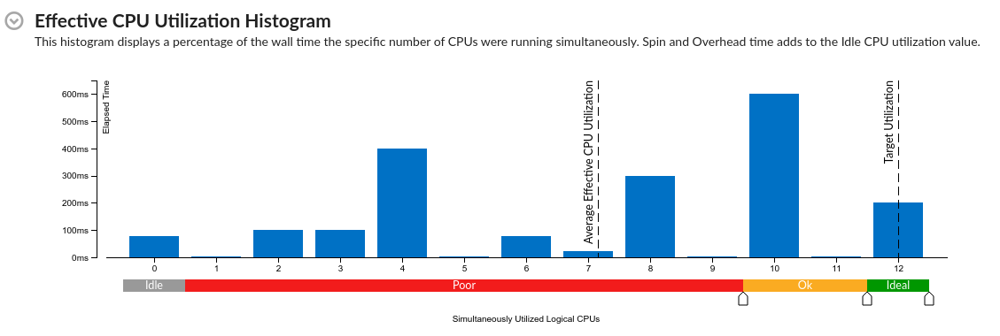

# Multithreaded Mandelbrot written in C++

## TODO:

- [x] Take out bmp class and replace with arrays
- [ ] Add zooming and panning functionality to mandelbrot math
- [x] Update mandelbrot math and data structures so they can be used in parallel
- [x] Add parallel functionality to mandelbrot class
- [ ] Generate AVX2 instructions for mandelbrot class
- [ ] Add testing to see speed ups, maybe use `std::chrono::high_resolution_clock` as suggested [here](https://stackoverflow.com/questions/21856025/getting-an-accurate-execution-time-in-c-micro-seconds)

**Optional:**

- [ ] Add SFML window to see mandelbrot in real time
- [ ] Generate partial images first to see where we need to perform calcs
- [ ] Test some kind of caching system
- [ ] Pipeline Mandelbrot generation for smoother/higher frame rates

## Pipelining ideas

Introduce a pipeline and cache for zooming in and out.

Previous frame (cached) > Current frame (next to be cached) > Interpolated frame > Next Frame

## Multithreading ideas

An initial run through Vtune suggests that some cores are getting more heavily used than others. This makes sense as some sections of the mandelbrot require all 1000 iterations while other sections require only a few iterations.

Ideas to fix this:

1. Build a thread pool with a checkout system where each thread executes a row, then returns, then checks out another row, executes, returns, etc. This way each thread may be used more effectively.
2. Assigne each thread to the only doubles of their original position. E.g. thread 0 executes rows 0, 12, 24, 36, 48, etc. This way the rows would be more evenly spread between threads, so they should execute at normal times. This would only provide a speed up for some zoom levels of the mandelbrot.

# Report

For my C++ programming class we wrote a simple Mandelbrot generator. As a TA I wanted to rewrite the program
and how much speed I could get from the program. My goal is to generate 1080x1920p images at 30 fps.

# Initial Program

My original program implemented a array with the data for the Mandelbrot image, and iterated over the
array calculating each points Mandelbrot iteration.

My original program used no optimization flags, no vectorization, and no multi-threading. Implementing each of these
provides an opportunity to speed up Mandelbrot generation.

## Optimization Flags

Using G++ And Clang++ I added the `-O3`, `-march=native`, and `-m64` flags to improve performance. As we will see from later plots this ends
up improving our speed by a factor of two.

## Threading

The program spawns 12 threads (using `std::thread`) and assigns them a portion of the Mandelbrot work. Again we can see that this dramatically improves
runtime, by more than a factor of two.

We can see that these two optimization provide a significant speedup over my naive implementation.
The threading model is not the best however. It assigns an even number of work to each thread, regardless of the length that
the work will take.

If we run the program through Intel Vtune, we can see that the threads are being used unevenly.

